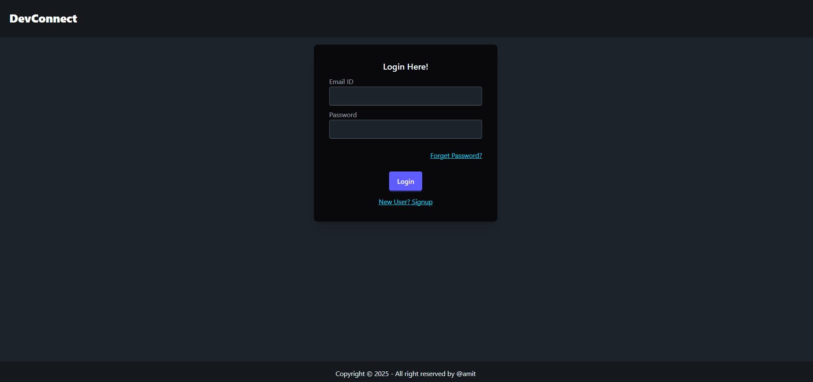
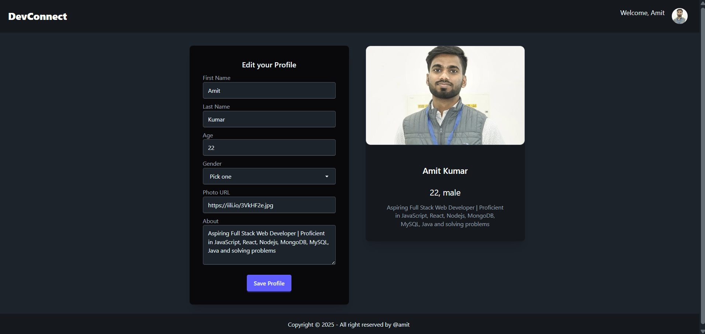
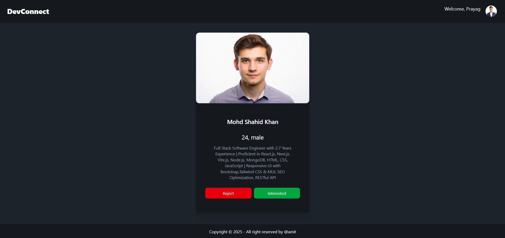
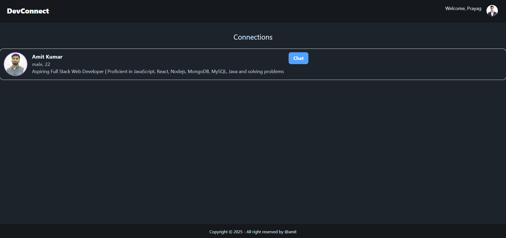
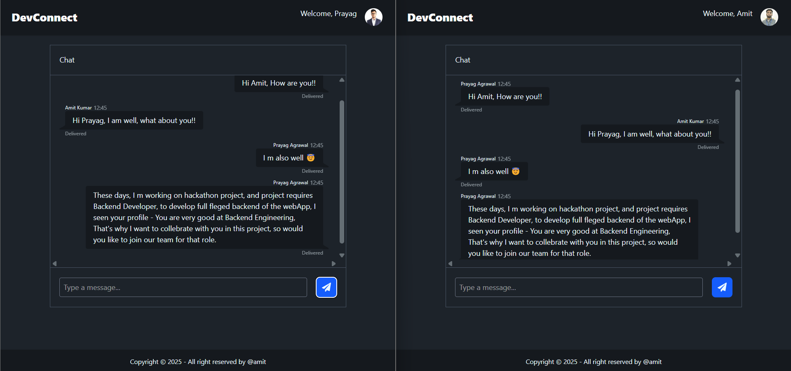
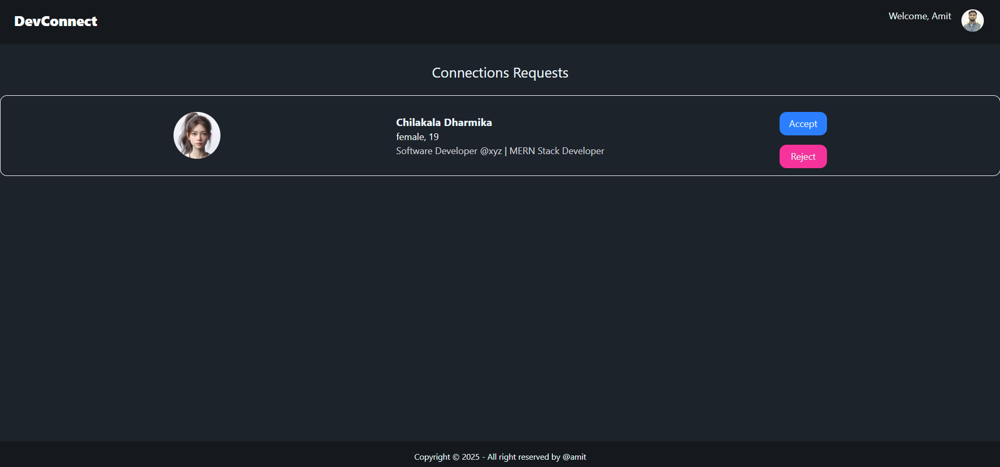
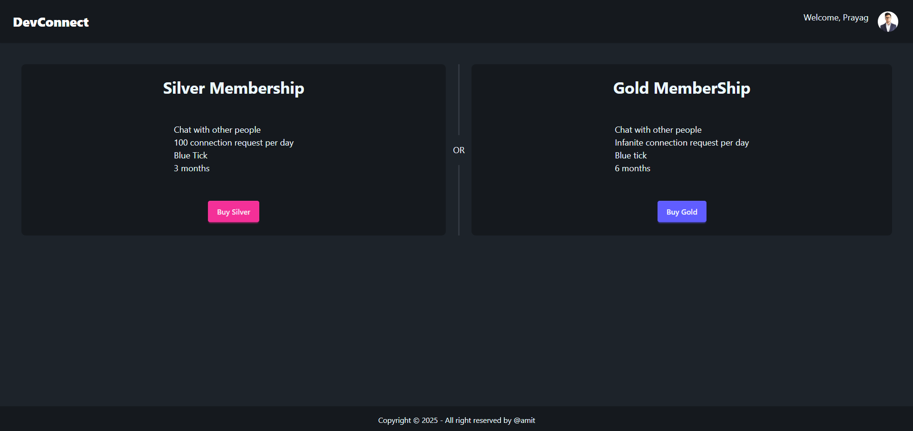
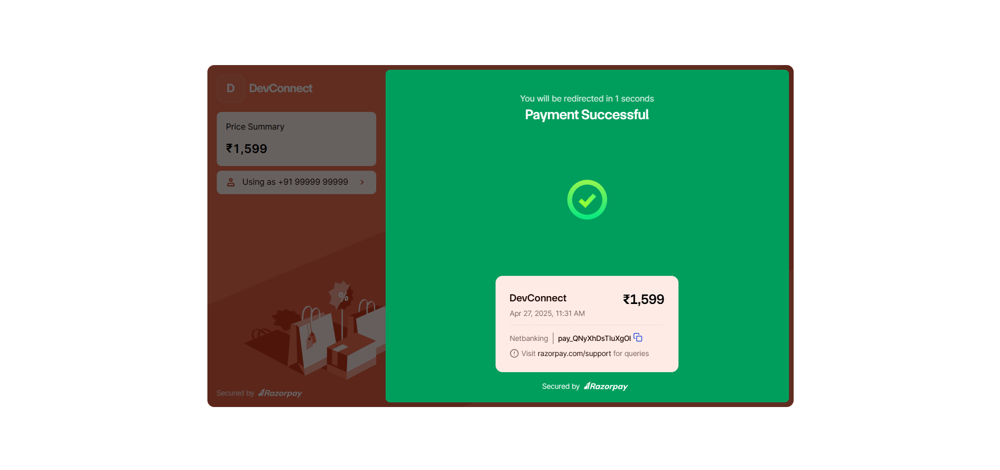

## Problem We Set Out to Solve

We realized that while LinkedIn and other platforms give developers space to list their skills, they don't always allow for showcasing projects dynamically. So, our main goal was to build a portfolio-based platform where users can easily upload their work, display projects, and highlight their technical abilities.

## Introduction
DevConnect is a full-stack web application designed to help developers build and showcase their portfolios, while allowing employers to easily discover and connect with talent. Developers can create profiles by entering their personal information, skills, and projects, along with uploading photos and links to their work. Employers can search for developers based on specific criteria and view detailed profiles to assess their qualifications. The platform serves as both a portfolio builder for developers and a recruitment tool for employers, providing a streamlined way for both parties to connect.

## Introduction: Inspiration Behind DevConnect

DevConnect started as a passion project for a group of developers who wanted to solve a simple but crucial problem: helping developers showcase their skills and projects in a way that's easy for employers to find and evaluate. We envisioned a platform where developers could highlight their achievements and recruiters could find the talent they need.

Our inspiration came from seeing how difficult it was to stand out in the sea of applicants on traditional platforms like LinkedIn. We wanted to create a space that truly put developers' work and portfolios front and center, showcasing their projects in a visually appealing and functional way.

### The Challenges

While we had the vision, bringing it to life was a technical challenge. Some of the hurdles we faced included:
- **Database Design:** Structuring the database to support dynamic portfolio updates and search functionalities.
- **Responsive Design:** Ensuring that DevConnect looks great across devices was harder than expected. We struggled with CSS breakpoints and responsiveness, but eventually found solutions through grid and flexbox layouts.
- **Image Upload and Display:** Handling media uploads in a way that’s secure and scalable took time to figure out.

However, these challenges helped us grow as developers, and we learned a lot through trial and error.


## Installation

To get started with the DevConnect, you'll need to have Node.js and npm installed on your machine. Once you've done that, you can install the dependencies by running the following command in your terminal:

```
> npm install
```

Then, to use the DevConnect, simply run the following command in your terminal:

```
> npm run dev
```

Same step repeat in backend also, This will start the development server and open the project in your browser at Frontend at : http://localhost:5173 and Backend at http://localhost:5000


## Screenshots

Here's a look at DevConnect in action!

## LoginPage


## ProfileEdit Dashboard


## Feed page


## Connection page


## Chat Dashboard


## RequestsPage


## MemberShip page


## PaymentGateway Dashboard


## Next Iterations and Future Plans

We have a lot of ideas for the next iteration of DevConnect. Some features we plan to implement.

## Deployed Site
[DevConnect](https://devconnect.solutions/)
